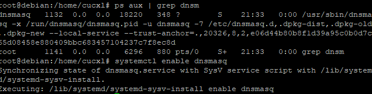
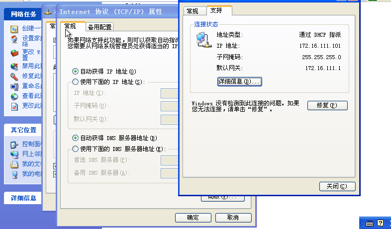
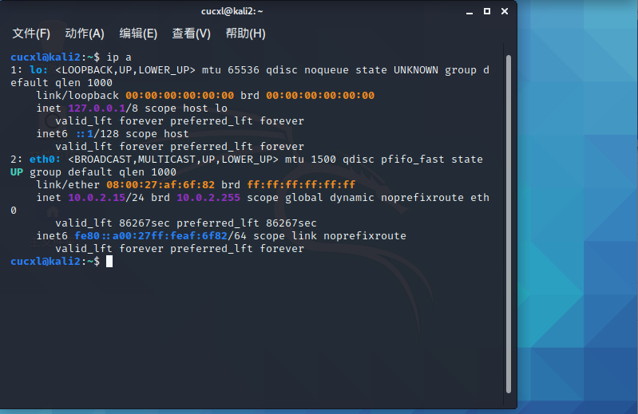
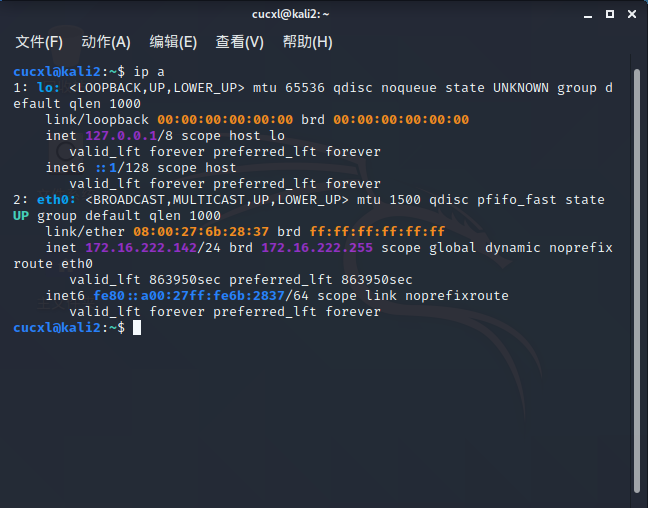

#  实验一 基于 VirtualBox 的网络攻防基础环境搭建

## 实验目的

- 掌握 VirtualBox 虚拟机的安装与使用；
- 掌握 VirtualBox 的虚拟网络类型和按需配置；
- 掌握 VirtualBox 的虚拟硬盘多重加载；

## 实验环境

本次实验需要使用的网络节点及相关软件，版本等信息：

- VirtualBox 虚拟机 版本6.1.14
- 攻击者主机（Attacker）：Kali 2020.3
- 网关（Gateway, GW）：Debian Buster 10.5.0
- 靶机（Victim）： xp 专业版 / Kali 2020.3


|   虚拟机名称   |      网卡选择      |                       IP地址                        |
| :------------: | :----------------: | :-------------------------------------------------: |
| gateway:debian |  NAT网络   |                     10.0.2.15/24                   |
|                |   Host-Only网络    |                  192.168.56.101/24                  |
|                | 内部网络，intnet-1 |                  172.16.111.1/24                   |
|                | 内部网络，intnet2  |                   172.16.222.1/24                 |
|  victim:xp1   | 内部网络，intnet-1 | 172.16.111.101  |
|  victim:xp2   | 内部网络，intnet-2 | 172.16.222.117  |
| victim:kali2  | 内部网络，intnet-2 | 172.16.222.142 |
| attacker:kali attacker  |  NAT网络   |            10.0.2.15/24                     |
  
## 实验过程

### 环境安装

+ 安装虚拟机软件Virtualbox。
+ 下载kali、debian、windows xp的镜像，所选择的安装镜像全名如下：
  + kali：kali-linux-2020.3-installer-amd64.iso
  + debian：debian-10.5.0-amd64-netinst.iso
  + xp: zh-hans_windows_xp_professional_with_service_pack_3_x86_cd_vl_14-74070.iso

+ 使用多重加载方式配置虚拟机。

  + 新建虚拟电脑 `kali attacker`，作为攻击者主机使用刚才下载的kali镜像；

  + 完成安装过程后释放虚拟盘，将虚拟硬盘改成多重加载模式（kali-Attacker.vdi会从虚拟电脑kali-Attacker解除关联）;

    

  + 检查虚拟机器kali-Attacker的设置为**硬盘启动优先**、**没有盘片**、**使用NAT网络**，检查没有问题便可以启动；

  + 新建虚拟机器`kali2`,作为配有内部网络intnet2网络的靶机，创建硬盘时使用**使用已有的虚拟硬盘文件**，选择**kali-Attacker.vdi(多重加载，12.00GB)**。

  + 至此，以`kali`为基础镜像的多重加载已经完成。对于以`xp`和`debian`为镜像的虚拟机器的多重加载的方式与Kali类似，因此不过多赘述。至此，完成了本次实验所需的所有虚拟机器的安装。

+ 接下来配置如下图所示的网络拓扑：
  
     
  
  配置的具体方案是，kali attacker作为攻击者主机，debian作为网关。由于计算机性能限制，靶机限定为3台。xP1单独在一个局域网内，kali2与xP2在一个局域网内。共计五台虚拟机如下图。

    

### 网络配置

启动网关后发现，除了本地回环地址`lo`和第一块网卡（NAT网络）对应的`enp0s3`是有ip地址的，网卡2`enp0s8`（intnet1）和网卡3`enp0s9`（intnet2）均无IP地址。

对网关进行DNS与DHCP配置。

+ 第一步：为网关debian的emp0s8（第二块网卡，对应着内部网络intnet1）设置IP，便于SSH连接

  + 具体做法是编辑 [`/etc/network/interfaces`](./interfaces.txt)，添加配置如下图：

    ```shell
    allow-hotplug enp0s8 
     #注意配置网卡不要用AUTO。可能导致开机时间过长。
    iface enp0s8 inet dhcp
    ```
    
  + 然后使用su命令进入root用户，重启networking使得配置生效：

    ```shell
    su
    sudo systemctl restart networking
    ```
  + ip配置成功对SSH进行配置。使用PUTTY进行SSH连接以便后续操作。PUTTY连接成功：  
    
    

+ 第二步：对网关debian配置网卡

  + 配置 /etc/network/interfaces 文件

    ```shell
    # /etc/network/interfaces
    # This file describes the network interfaces available on your system
    # and how to activate them. For more information, see interfaces(5).

    source /etc/network/interfaces.d/*  

    # The loopback network interface  
    auto lo
    iface lo inet loopback

    # The primary network interface  
    allow-hotplug enp0s3  
    iface enp0s3 inet dhcp  
    post-up iptables -t nat -A POSTROUTING -s 172.16.111.0/24 ! -d 172.16.0.0/16 -o enp0s3 -j MASQUERADE  
    post-up iptables -t nat -A POSTROUTING -s 172.16.222.0/24 ! -d 172.16.0.0/16 -o enp0s3 -j MASQUERADE  

    # demo for DNAT  
    post-up iptables -t nat -A PREROUTING -p tcp -d 192.168.56.113 --dport 80 -j DNAT --to-destination 172.16.111.118  
    post-up iptables -A FORWARD -p tcp -d '172.16.111.118' --dport 80 -j ACCEPT  

    post-up iptables -P FORWARD DROP  
    post-up iptables -A FORWARD -m state --state RELATED,ESTABLISHED -j ACCEPT  
    post-up iptables -A FORWARD -s '172.16.111.0/24' ! -d '172.16.0.0/16' -j ACCEPT  
    post-up iptables -A FORWARD -s '172.16.222.0/24' ! -d '172.16.0.0/16' -j ACCEPT  
    post-up iptables -I INPUT -s 172.16.111.0/24 -d 172.16.222.0/24 -j DROP  
    post-up iptables -I INPUT -s 172.16.222.0/24 -d 172.16.111.0/24 -j DROP  
    post-up echo 1 > /proc/sys/net/ipv4/ip_forward  
    post-down echo 0 > /proc/sys/net/ipv4/ip_forward  
    post-down iptables -t nat -F  
    post-down iptables -F  
    allow-hotplug enp0s8  
    iface enp0s8 inet dhcp  
    allow-hotplug enp0s9  
    iface enp0s9 inet static  
    address 172.16.111.1  
    netmask 255.255.255.0  
    allow-hotplug enp0s10  
    iface enp0s10 inet static  
    address 172.16.222.1  
    netmask 255.255.255.0 
    ```
  
  + 完成后重启网卡查看debian网关状态。效果如下：
  
  
  + 同时可以通过指定ip地址的方式使xp1靶机连接至intnet1.连接时注意关闭防火墙
  
  

+ 第三步：对debian网关配置dnsmasq

  + 安装dnsmasq，为网关配置dhcp和dns服务

    ```shell
    apt-get update  
    apt-get install dnsmasq 
    ```
  + 修改dnsmasq配置文件，修改前需要备份

    ```shell
    diff dnsmasq.conf dnsmasq.conf.bak

    661,662c661 
    < log-queries 
    < log-facility=/var/log/dnsmasq.log 
    --- 
    > #log-queries 
    665c664 
    < log-dhcp 
    --- 
    > #log-dhcp
    ``` 
  
  + 重启服务及设为自启动服务

    ```shell
    systemctl restart dnsmasq
    systemctl enable dnsmasq
    ```

   

  + 修改完成后重启dnsmasq服务在xp1靶机上，可以实验探究到，此时网关已经具备自动分配IP地址的功能。即使将xP的连接方式设置为自动,xp1靶机也可以自动连接至intnet1而不需要指定ip地址
  
  
  
  + 攻击者主机kali attacker 使用NAT网络，靶机kali2使用intnet2网络。均可自动获取地址。
  
  

  
  
+ 第四步：在靶机xp1上检查debian网关配置情况。进行网络连通性测试，看是否可以`ping`通互联网。

  

  


## 网络连通性测试

- [√] 靶机可以直接访问攻击者主机

  

- [√] 攻击者主机无法直接访问靶机

  

- [√] 网关可以直接访问攻击者主机和靶机

  


- [√] 靶机的所有对外上下行流量必须经过网关方法：

  + 靶机访问互联网后，查看网关上的dnsmasq日志

  + intnet1的靶机xp1流量过网关
  


  + intnet2的靶机kali2流量过网关
  

- [√] 所有节点均可以访问互联网

  + wdebian网关前文已测试，不再重复
  + 由下图可以看出,intnet1的靶机xp1可以访问互联网：
  
  + 由下图可以看出,intnet2的靶机kali2可以访问互联网：
  


## 遇到的问题

1. 问题一（已解决）：

    + 问题描述（发生时忘记截图了）：

    在配置xp1时忘记选择指定的网卡，直接进行了指定ip地址分配。后续发现xp需使用FAST-3网卡，修改后xp1虚拟机报错：
    “这个IP地址已经分配给另一个适配器。。。（省略处为创建xp虚拟机时默认网卡），。。。从网络和拨号连接文件夹中隐藏，因为它本身并没有在计算机中存在，或是个不工作的旧适配器。如果相同的地址分配给两个适配器，并且它们都处于活动状态，只有一个会使用这个地址，这会造成不正确的系统配置。您想从高级对话框的IP地址列表输入不同的IP地址给这个适配器吗？” 

    + 问题原因：

    查阅资料后发现，这种情况是由于在更换网卡的时候的时候没有卸载网卡驱动，使得原来所设的ＩＰ地址与网卡信息还一直留在注册表中，当然给新的网卡设置这个ＩＰ地址的时候，系统就会将信息注入注册表，此时它会发现该地址已经在注册表中存在，并已分配给了另一个网络适配器，要知道网络中是不允许分配两个ＩＰ相同的ＩＰ地址的，所才会弹出了提示

    + 解决方法：

    开始→运行→regedit 打开注册表,菜单栏上依次点击“编辑”→查找→输入你要设的ＩＰ地址，然后开始查找。 
    将查找到的注册表项或值通通删除，切记要搜索查找两次，才能完全找到以前旧网卡以及所设的ＩＰ地址的残留信息
    删完后关闭注册表，在桌面的任务栏上单击鼠标右键选择：属性→任务管理器→进程→找到的一名为explorer.exe的进程结束它，然后再点击新建任务，弹出的窗口再输入explorer.exe按回车

2. 问题二（已解决）：
   
   此问题与网络安全微信群里陈安捷问题重复，即GURB安装位置设置错误。解决方法不再赘述。


## 实验参考
+ [往期作业](https://github.com/CUCCS/2019-NS-Public-chencwx/blob/ns_chap0x01)
+ [黄药师教学视频](https://b23.tv/Dzvdxb)
+ [CSDN论坛（问题1解决资料来源)](blog.csdn.net/weixin_33953249/article/details/92665946)
+ 网络安全微信群


