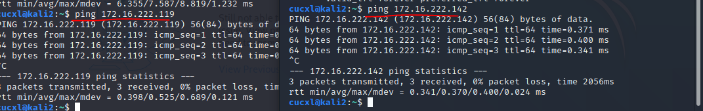

# 网络安全第十章实验报告  

## 应用程序安全加固  

### 实验目的

从web和ssh方面进行应用程序安全加固

### 实验环境  
Kali 2020.3  
fail2ban  


#### 网络拓扑  
kali-attacker和kali2两台互相连通的虚拟机,在同一个局域网下（拓扑结构简单就不上图了）

 
### 实验过程 


### web安全加固 
* 先查看可用的模块并搜索需要的security模块
```
ls -l /etc/apache2/mods-enabled/

apt search apache | grep security
# 搜索security软件包
```  
 
 
* 安装相关模块， 查看刚刚下载的与security相关的包
```
apt update &&apt-get install libapache2-mod-security2

ls /etc/apache2/mods-enabled/
```


* 配置规则
```
# 备份规则
mv /usr/share/modsecurity-crs /usr/share/modsecurity-crs.bk

# 下载 OWASP ModSecurity Core Rule Set
git clone https://github.com/SpiderLabs/owasp-modsecurity-crs.git /usr/share/modsecurity-crs

# 启用配置文件
cd /user/share/modsecurity-crs
mv crs-setup.conf.example crs-setup.conf

# 修改配置
vi /etc/apache2/mods-enabled/security2.conf

# 在文件中添加规则路径
<IfModule security2_module> 
     SecDataDir /var/cache/modsecurity 
     IncludeOptional /etc/modsecurity/*.conf 
     IncludeOptional /usr/share/modsecurity-crs/*.conf 
     IncludeOptional /usr/share/modsecurity-crs/rules/*.conf 
 </IfModule>

# 启用引擎
vi /etc/modsecurity/modsecurity.conf

# 将 DectionOnly 改为 On
SecRuleEngine On

# 重启以生效
systemctl restart apache2
```
 

 
   

* 让攻击者主机对靶机进行简单的xss攻击（使用curl命令），发现被拒绝.查看日志文件，会发现该行为被记录了

   

### ssh安全加固

* 正常情况下，kali无法直接进行ssh链接。我们需要修改靶机的ssh配置
```
- 启动服务
systemctl start ssh

- 修改配置文件，允许Root用户使用ssh登录
gedit /etc/ssh/sshd_config

- 在Authentication部分添加
PermitRootLogin	yes 

- 重启ssh服务
systemctl restart ssh
```


* 攻击者主机修改配置后能够正常ssh连接


* 解压爆破字典，使用字典进行爆破
```
- 解压爆破字典
gzip -d /usr/share/wordlists/rockyou.txt.gz

- 类似的爆破工具还有：medusa/ncrack
hydra -l root -P /usr/share/wordlists/rockyou.txt -v 172.16.222.119 ssh
```


* 弱指令爆破成功（有一个问题。写在了'问题与解决'部分）


* 安装并启动后fail2ban，需要手动设置开启jail
```
- 安装
git clone https://github.com/fail2ban/fail2ban.git
cd fail2ban
sudo python setup.py install

- 查看是否安装成功
fail2ban-client -h

- 启动 fail2ban
fail2ban-client start

- 预置的jail
ls /etc/fail2ban/filter.d/
```


* 对 jail.conf fail2ban.conf 等配置文件中的配置项进行自定义配置
```
- 拷贝配置文件并重命名为 `jail.local`
cp /etc/fail2ban/fail2ban.conf /etc/fail2ban/jail.local
gedit /etc/fail2ban/jail.local

- 添加以下内容开启sshd jail
[sshd]
enabled = true

- 查看相关的配置信息
- 默认禁止时间为 10 min ，可在 `jail.local` 文件中自定义（而无需修改当前默认的配置文件）
gedit /etc/fail2ban/jail.local
```


* 在进行爆破以后，发现了被禁止的ip，在防火墙中我们也可以看到被禁止的ip，说明该禁止的原理就是通过设置防火墙规则进行拒绝


* fail2ban已经生效，不再可以随意爆破ssh服务.在攻击者主机上重复实验，发现迟迟没有反应

上面红线为禁止前，爆破成功；下面红线为禁止后，拒绝访问。

* 使用以下命令清空刚刚的规则，保持环境的'干净'。实验完成。
```
fail2ban-client unban all
```

### 问题及解决  
1. 下载 OWASP ModSecurity Core Rule Set下载极慢 
原因：可能是文件源在国外 

2. 在弱口令爆破的环节，root密码分别设置为wlaq,123,123456.结果最后一项（123456）很快就爆破出结果，而前两项（wlaq,123)过了很久也没有爆破成功。
猜测是不是这个爆破机制的问题，导致前两项破解速度慢

在密码为123时，不停重复如图步骤

3. fail2ban启动失败

原因：权限不足
解决方法：sudo 
#### 参考资料  
[网络安全教材第十章](https://c4pr1c3.github.io/cuc-ns/chap0x10/main.html)  
[网络安全第十章课件](https://c4pr1c3.github.io/cuc-ns-ppt/chap0x10.md.html#/16/1)  
[Using Fail2ban to Secure Your Server - A Tutorial](https://www.linode.com/docs/guides/using-fail2ban-to-secure-your-server-a-tutorial/)  
[kali linux 开启SSH服务 容许root登陆](https://blog.csdn.net/u010953692/article/details/80312751)  