# 常见蜜罐体验和探索

## 实验目的

- 了解蜜罐的分类和基本原理
- 了解不同类型蜜罐的适用场合
- 掌握常见蜜罐的搭建和使用

## 实验环境

- 从paralax/awesome-honeypots中选择 1 种低交互蜜罐和 1 种中等交互蜜罐进行搭建实验
  
  - 推荐 `SSH` 蜜罐
  
- 实验网络拓扑：

  

## 实验要求

- [√] 记录蜜罐的详细搭建过程；
- [√] 使用 `nmap` 扫描搭建好的蜜罐并分析扫描结果，同时分析「 `nmap` 扫描期间」蜜罐上记录得到的信息；
- [√] 如何辨别当前目标是一个「蜜罐」？以自己搭建的蜜罐为例进行说明；
- [√] （可选）总结常见的蜜罐识别和检测方法；
- [❌] （可选）尝试基于 [canarytokens](https://github.com/thinkst/canarytokens) 搭建蜜信实验环境进行自由探索型实验；


## 实验过程

+ 检查两台虚拟机主机网络连通性

  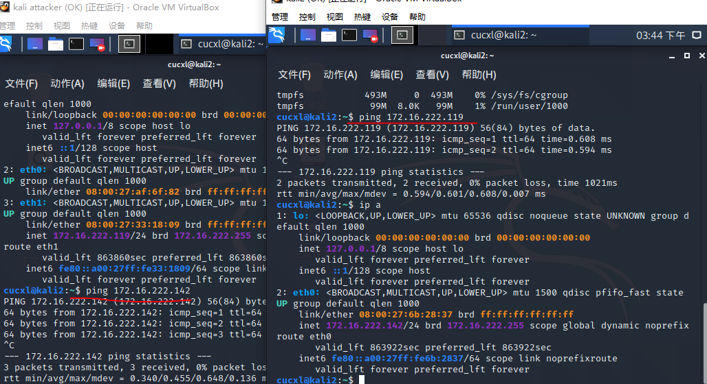

+ 接下来的实验在`kali2`中搭建蜜罐，`attacker`中模仿攻击者去攻击伪`victim`

### ssh-Honeypot

+ 这是是一种极低交互式的简易蜜罐。根据作者主页介绍：
```
This program listens for incoming ssh connections and logs the ip address, username, and password used. This was written to gather rudimentary intelligence on brute force attacks.
此程序侦听传入的ssh连接并记录所使用的IP地址、用户名和密码。这是为了收集关于暴力袭击的基本情报。
```
蜜罐功能与ssh连接相关，从这方面验证蜜罐性能。

+ 在`kali2`中安装docker容器，便于后续实验的观察

+ 添加docker-ce的apt下载源，下载有关软件

  ```bash
  apt-get update
  apt-get install -y apt-transport-https ca-certificates curl software-properties-common
  ```

  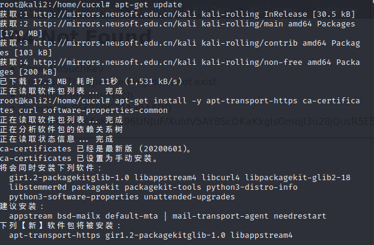

+ 添加docker安装所需要的密钥,验证密钥的可用性并进行docker-ce的安装

  ```bash
  curl -fsSL https://download.docker.com/linux/debian/gpg | sudo apt-key add -
  sudo apt-key fingerprint 0EBFCD88
  sudo apt-get update
  sudo apt-get install docker-ce
  
  ```

  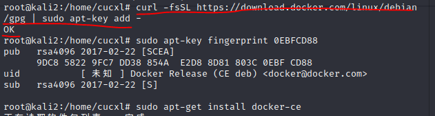

  
+ 开启docker服务并测试是否安装成功

  ```bash
  systemctl start docker
  sudo docker run hello-world##测试安装成功
  ```

  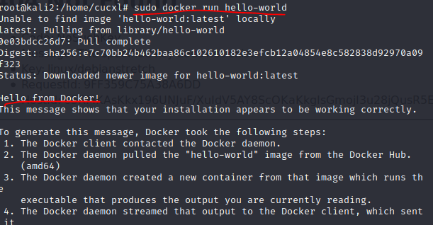

+ 使用`docker image`指令查看镜像

  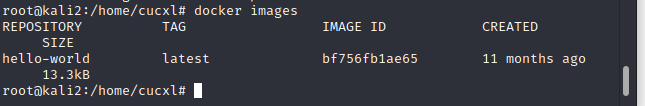

+ 安装ssh-honeypot

  ```bash
  apt install libssh-dev libjson-c-dev
  ```

  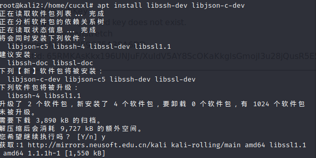

+ 安装ssh，设置密码为空

  ```bash
  $ ssh-keygen -t rsa -f ./ssh-honeypot.rsa
  ```
  
  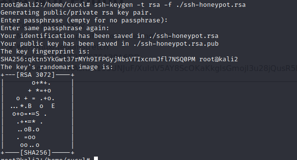
  
+ 接下来安装`docker-ssh-honeypot`

  ```bash
  git clone https://github.com/random-robbie/docker-ssh-honey
  docker build . -t local:ssh-honeypot #bulid构建镜像
  docker run -p 2234:22 local:ssh-honeypot #运行镜像 本地端口2234，容器端口22 
  docker exec -i -t id bash #进入容器
  tail -F ssh-honeypot.log #蜜罐查看日志
  ```

  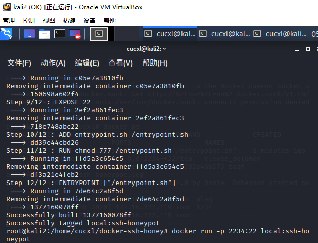
  
  
+ 通过`docker ps`查看容器的id,这样才能进入容器

  ```bash
  docker ps
  docker exec -i -t container_id bash #进入容器
  ```

  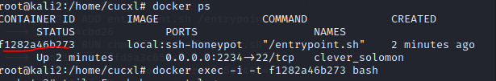

+ 可以进行查看日志，这样即可看到攻击者的行为

  ```bash
  tail -F ssh-honeypot.log#查看日志
  ```

  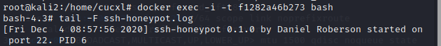

+ 接下来让`attacker`对蜜罐所在主机端口进行ssh连接，同时观察攻击者主机和受害者主机，多次连接发现无法连接成功。联想到蜜罐的功能包括阻止ssh恶意破解登录，推测无论如何都无法成功连接。在尝试过程中，发现受害者主机的honeypot程序可以成功记录攻击者IP,尝试的用户名和密码

  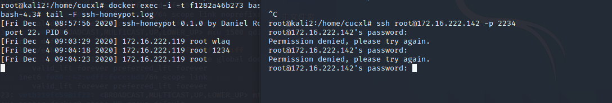

+ 接着`attacker`对蜜罐主机进行nmap端口扫描，发现日志信息中并没有对此记录，说明该蜜罐并未对此做出反应，说明了该蜜罐的低交互式，只是一个可以简单阻止并记录ssh连接的简易蜜罐

  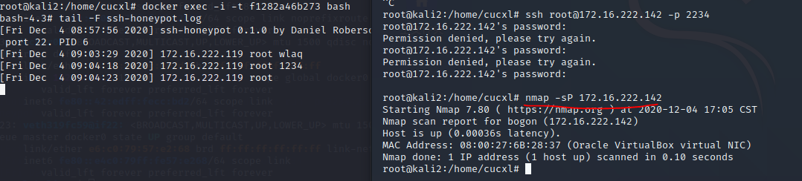

  
  
### Cowrie

+ Cowrie是一种中到高交互性的SSH和Telnet蜜罐，旨在记录暴力攻击和攻击者执行的shell交互。在中等交互模式（shell）下，它以Python仿真UNIX系统；在高级交互模式（代理）下，它充当SSH和telnet代理，以观察攻击者对另一个系统的行为。

+ Cowrie选择以仿真外壳运行（默认）：具有添加/删除文件功能的伪造文件系统。包含类似于Debian 5.0安装的完整伪造文件系统可能添加伪造的文件内容，以便攻击者可以监视/ etc / passwd等文件。仅包含最少的文件内容Cowrie保存使用wget / curl下载的文件或通过SFTP和scp上传的文件，以供以后检查；或将SSH和telnet代理到另一个系统:作为具有监控功能的纯telnet和ssh代理运行或者让Cowrie管理Qemu虚拟服务器池以提供登录到的系统

+ 在`kali2`主机docker中安装[Cowrie](https://hub.docker.com/r/cowrie/cowrie)，下载安装成功后启动。

  ```bash
  docker pull cowrie/cowrie
  ```

  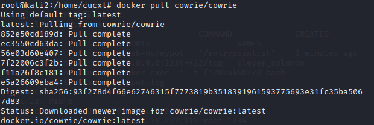

+ 启动cowrie，在端口2222开启，同时在`attacker`中进行ssh连接攻击者，使用密码登录，发现登录成功。同时`kali2`主机的Cowrie蜜罐成功记录了ssh连接的时间，IP地址，连接使用的用户名和密码等信息。
  
  ```bash
  docker run -p 2222:2222 cowrie/cowrie
  ```
  
  
  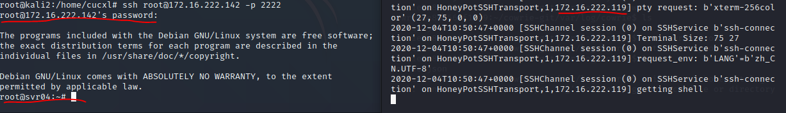
  

  
+ 实验继续探究。尝试ping命令能否成功。成功在蜜罐环境中运行。并且`kali2`的监听进程成功记录了这一操作。curl指令运行成功。蜜罐的网络环境连通性正常
  ```bash
  ping www.baidu.com 
  curl http://www.baidu.com/helloworld
  ```
  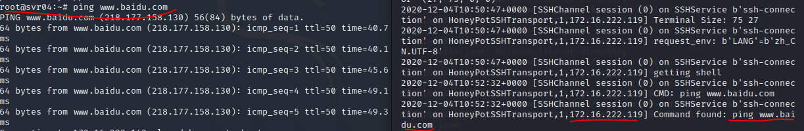
  
+ 尝试查看蜜罐环境中的文件。发现可以查看。部分文件夹也成功打开。`kali2`监听进程成功记录
  

  
  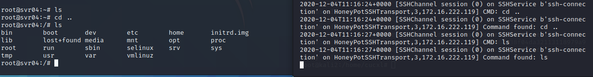
  

  
+ 尝试进行apt下载，ssh连接突然异常断开。推测这个连接有时间或是流量的限制。超过限制就会自动断开

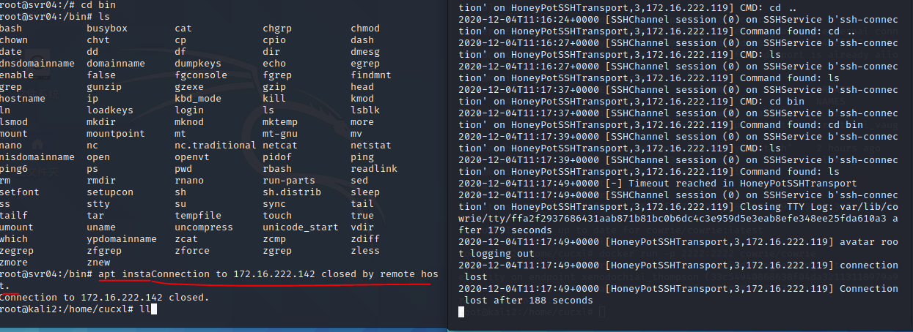
  


### 总结常见的蜜罐识别和检测方法

+ 实验中总结：

实验中使用的低交互ssh蜜罐无法正常ssh连接，而高交互蜜罐无论输入什么密码都能连接成功。而且高交互式蜜罐在ssh连接一段时间后会自动断开。推测可以通过ssh连接异常的角度判断蜜罐存在。

以下是查阅资料获得的蜜罐识别方法：

+ 检测低交互蜜罐：
1. 配置失真与资源抢夺
我们已经知道低交互蜜罐是不能够给敌人提供一个完整的操作系统环境，所以可以通过使用一些复杂的命令和操作，以及一些想不到的输出解决来检查是不是处在蜜罐环境中。另外一种情况就是出现了配置失真，也就是说在一台机器上出现了两种不同平台的服务，举个例子：运行一个Windows的Web服务器同时运行了一个Linux的FTP服务器，这样的话就出现了配置失真。使用nmap -sV这个方法可以来观察开启的服务，如果发现了平台与服务不匹配的，说明这很有可能就是一个蜜罐。
与低交互蜜罐检测最主要的方式是通过网络，这样就意味着低交互蜜罐运行在一个具有正常操作系统的，只要是在操作系统中，不可能把所有的资源都分配给蜜罐，所以如果在蜜罐中执行一个很繁琐很耗资源的操作，这样蜜罐就会和其他服务进程去争抢资源，最直观的感受就是蜜罐的反应速度会慢下来。但是我们通常不具备这个权限来访问这种类型的服务或者是进程，所以我们必须得考虑从网络通信入手，增加蜜罐的操作负载，如果换一个角度想，可不可以让其他的服务去和蜜罐争抢资源，来拖慢蜜罐的反应速度，举个例子比如说如果蜜罐系统和一个web服务器同时运行在一台机器上，我们可以从web服务器入手，去给web服务器发送大量http请求，导致web服务器抢占大量计算机资源用来处理请求。这样就会让蜜罐的反应慢下来。

2. 数据包时间戳分析
如果我们仅通过查看网络数据包能很容易的推断出一个机器的物理属性，我们就很有可能辨别物理服务器和虚拟蜜罐。事实证明，TCP提供了一些直接反映底层服务器状态的信息。TCP时间戳选项被网络堆栈用于确定重传超时时间。机器中的无历史中安特定频率更新时间戳，我们也知道，所有的物理时钟都有一定时钟偏差，他们或多或少于实际运行时间。通过打开一个到主机的TCP链接，并记录为每个连接所提供的时间戳，就可以去观察时间偏差。我们的希望是每个物理系统或者是操作系统显示出来不同的偏差。如果说一个服务器上运行了多个蜜罐的话，就容易出现每一个蜜罐出现相同的时间偏差，这样的话蜜罐就完全暴露了。这种基于对硬件检测的思想也可以在一定程度上去实现检测是不是蜜罐。

+ 检测高交互蜜罐:

1. 检测虚拟机：VMWare硬件虚拟化创建一个x86的硬件平台界面，允许安装任何操作系统。我们可以利用虚拟化在同一个物理硬件上同时运行多个操作系统，除了更方便的资源管理，对于蜜罐操作者来说，主要是有点事虚拟机提供的隔离能力。还有一种方法就是提供低权限的用户取运行客户机操作系统，当客户执行一个特权命令的时候，vmm接受到一个陷阱，并可以模拟期望的行为，不过其他特权状态可能会驻留在客户的内存里。可以把这部分内存变为写保护。
虚拟机监视器需要提供的功能：保真度允许一个vmm运行任何软件性能允许快速执行客户机指令，也就是说几乎没有VMM的干预安全性要求VMM提供底层硬件资源的适当隔离除了虚拟化不同的操作系统之外，vmware也会虚拟硬件层，但是虚拟的硬件层里面会带有信息，所以可以使用以下命令去对信息进行判断:

```
sudo dd if=/dev/mem bs=64k skip=12 count=1| string -n10
```

输入这条命令后，虚拟机会和物理机得到不一样的输出.

可以通过输入来判断是否进入了虚拟机，但是虚拟机不能作为衡量蜜罐的一个标准，首先由于云计算和虚拟化技术的发展，可能你进入到虚拟机恰好是真实的生产环境，所以确定虚拟机后很难确定是否为蜜罐环境。


2. 环境不真实导致穿帮:

例如：来自Merit网络公司的John Oberheide等人注意到，HoneyD重组IP数据包分片不正确，根据RFC791，通过匹配原地址、目的地址、标识号和协议号来识别对应的分片。不幸的是HoneyD没有正确的实现匹配的步骤，在重组分片数据包时候忘记比较了协议号，出现问题的代码如下：

```
#define DIFF(a, b) 
do {
      if (
        (a)<(b)) 
        return -1;    
        if ((a)>(b)) 
        return 1;}
        while(0)
        int fragcompare(
          sturct fragment *a, struct fragment *b)
      {    
      DIFF(a->ip_src, b->ip_src);    
      DIFF(a->ip_dst, b->ip_dst);    
      DIFF(a->ip_id, b->ip_id);    
      Return (0);
      }

```

IP字段并没作比较，这导致了honeyd把具有相同原地址、目的地址、标识号和协议号的不同协议分片进行了重组。在正常操作中其实这样不会影响蜜罐功能，因为不太可能多个分片的四个字段只有这三个字段匹配。但是对于入侵者而言，如果是精心构造的数据包的话，honeyd可能会将这些数据包重组，而真实环境则可能会直接将数据包丢弃。


## 实验所遇问题

+ 问题：'apt-update'无法发起与 download.docker.com:443 (2600:9000:2135:c800:3:db06:4200:93a1) 的连接
 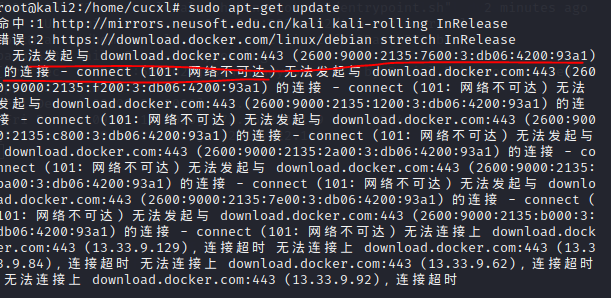

原因：网络出现故障

解决办法：重启网卡与虚拟机

+ 问题：重新ssh连接登录Cowrie蜜罐环境失败
 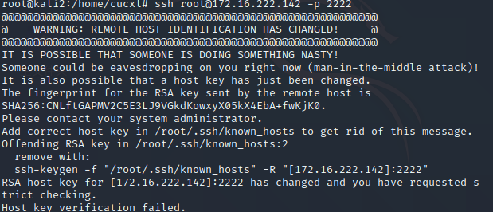

原因：虚拟机`kali2`判断通信被中间人攻击

解决办法：
```bash
ssh-keygen -f "/root./ssh/known_hosts" -R "IP:PORT"
```


## 实验参考资料


+ [ssh-honeypot](https://github.com/droberson/ssh-honeypot)
+ [cowrie](https://github.com/cowrie/cowrie)
+ [docker ssh-honeypot](https://github.com/random-robbie/docker-ssh-honey)
+ [ssh-honeypot简介](https://kalilinuxtutorials.com/kippo-honeypot-brute-force-attacks/)
+ [cowrie mannual](https://cowrie.readthedocs.io/en/latest/index.html)
+ [linux命令](https://www.jb51.net/LINUXjishu/661964.html)
+ [如何判断是否进入蜜罐](https://www.zhihu.com/question/31213254)
+ [canarytokens](https://docs.canarytokens.org/guide/getting-started.html#how-canarytokens-work-in-3-short-steps)
+ [canarytokens set-up](https://zeltser.com/honeytokens-canarytokens-setup/)

  
  


