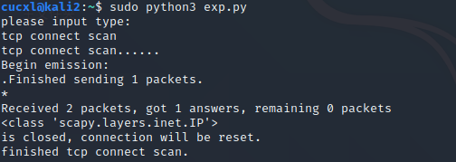
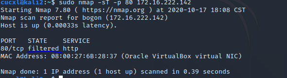
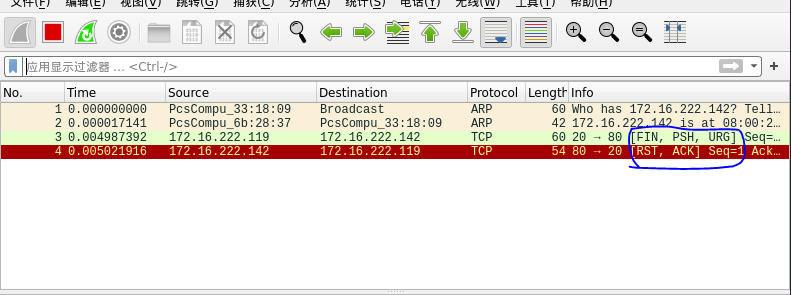
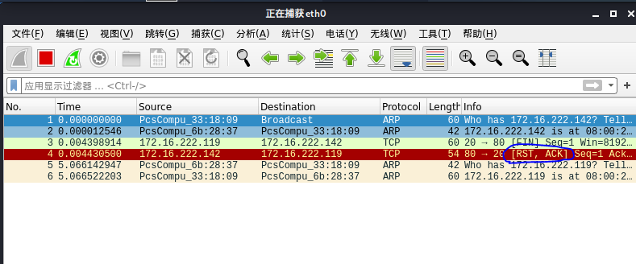
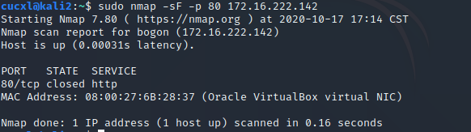
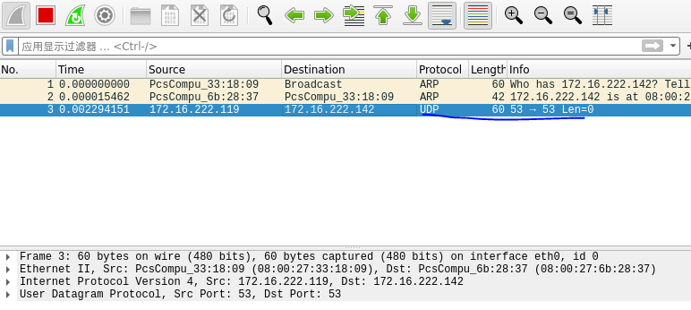

# 网络安全第五章实验报告  

## 基于 Scapy 编写端口扫描器  

### 实验目的  

* 掌握网络扫描之端口状态探测的基本原理  

### 实验环境  
* python3 + scapy 2.4.3  
* nmap  
* 用户为普通用户（非root），用户名cucxl
### 网络拓扑结构  
  
|身份|虚拟机名称|网卡|IP地址|
|--|--|--|--|
|网关|DEBIAN|intnet2|172.16.222.1|
|攻击者主机|KALI-attack|intnet2|172.16.222.119|
|目标靶机|KALI2|intnet2|172.16.222.142|  

### 实验要求  
- [√] 完成以下扫描技术的编程实现  
  * TCP connect scan / TCP stealth scan  
  * TCP Xmas scan / TCP fin scan / TCP null scan  
  * UDP scan  
- [√] 上述每种扫描技术的实现测试均需要测试端口状态为：`开放`、`关闭`和`过滤`状态时的程序执行结果  
- [√] 提供每一次扫描测试的抓包结果并分析与课本中的扫描方法原理是否相符？如果不同，试分析原因  
- [√] 在实验报告中详细说明实验网络环境拓扑、被测试 IP 的端口状态是如何模拟的  
- [√] （可选）复刻`nmap`的上述扫描技术实现的命令行参数开关

### 实验过程  
* 实验原理  
 
  

* 端口状态模拟  
  1. 关闭状态  
  `sudo ufw disable`  
  `systemctl stop apache2`  
  `systemctl stop dnsmasq` 关闭端口  
  2. 开放状态  
  `systemctl start apache2` 开启服务开放TCP端口  
  `systemctl start dnsmasq` 开启服务开放UDP端口  
  3. 被过滤状态  
  `sudo ufw enable && sudo ufw deny 80/tcp`  
  `sudo ufw enable && sudo ufw deny 53/udp`  


* TCP connect scan  
  ```
  #攻击者主机执行exp.py中相关内容
  from scapy.all import *
  def tcpconnect(dst_ip,dst_port,timeout=10):
      pkts=sr1(IP(dst=dst_ip)/TCP(dport=dst_port,flags="S"),timeout=timeout)
      if (pkts is None):
          print("FILTER")
      elif(pkts.haslayer(TCP)):
          if(pkts[1].flags=='AS'):
              print("OPEN")
          elif(pkts[1].flags=='AR'):
                  print("CLOSE")
  tcpconnect('172.16.222.142',80)
  ```  
    * 实验预期结果：
    如果攻击者主机向靶机发送SYN包，能完成三次握手，收到ACK,则端口为开放状态；若只收到一个RST包，则端口为关闭状态；倘若什么都没收到，即为端口过滤状态。

    * Closed  
    靶机检测自身端口状态  
     
    攻击者主机运行python脚本中`TCP connect scan`部分   
      
    靶机Wireshark抓包  
     
    分析：TCP三次握手机制，攻击者主机向靶机发送连接请求后，靶机相应端口处于关闭状态，靶机将会向攻击者返回[RST,ACK]包，抓包结果与预期结果一致。  

    * Open  
    靶机开放80端口  
    `systemctl start apache2` 开启apache2服务从而开放80端口  
    攻击者主机运行`TCP connect scan` python脚本  
      
    靶机Wireshark抓包  
    
    分析：TCP三次握手机制，攻击者主机向靶机发送连接请求后，收到靶机返回如图所示[SYN/ACK]数据包，抓包结果与预期结果一致。  

    * Filtered  
    靶机添加规则过滤80端口  
    `sudo ufw enable && sudo ufw deny 80/tcp`  
     
    攻击者主机运行python脚本中`TCP connect scan` 部分  
      
    靶机Wireshark抓包  
     
    分析：TCP三次握手机制，攻击者主机向靶机发送连接请求后，没有得到任何响应，抓包结果只收到一个发送的TCP包，与预期结果一致。  
* 攻击者主机`nmap`复刻  
  `sudo nmap -sT -p 80 172.16.222.142`  
  * Closed  
    
  * Open  
    
  * Filtered  
   

* TCP stealth scan
原理与TCP connect scan类似
  ```
  #攻击者主机执行stealth.py
  from scapy.all import *
  def tcpstealthscan(dst_ip , dst_port , timeout = 10):
      pkts = sr1(IP(dst=dst_ip)/TCP(dport=dst_port,flags="S"),timeout=10)
      if (pkts is None):
          print ("Filtered")
      elif(pkts.haslayer(TCP)):
          if(pkts.getlayer(TCP).flags == 0x12):
              send_rst = sr(IP(dst=dst_ip)/TCP(dport=dst_port,flags="R"),timeout=10)
              print ("Open")
          elif (pkts.getlayer(TCP).flags == 0x14):
              print ("Closed")
          elif(pkts.haslayer(ICMP)):
              if(int(pkts.getlayer(ICMP).type)==3 and int(stealth_scan_resp.getlayer(ICMP).code) in [1,2,3,9,10,13]):
                  print ("Filtered")
  tcpstealthscan('172.16.222.142',80)
  ```  
  * Open  
    
    
  * Closed  
     
    
  * Filtered  
    
    
* 攻击者主机`nmap`复刻  
  `sudo nmap -sS -p 80 172.16.222.142`  
  * Open  
   
  * Closed  
    
  * Filtered  
   

* TCP Xmas scan  
  ```  
  #攻击者主机执行exp.py
  from scapy.all import *
  def Xmasscan(dst_ip , dst_port , timeout = 10):
      pkts = sr1(IP(dst=dst_ip)/TCP(dport=dst_port,flags="FPU"),timeout=10)
      if (pkts is None):
          print ("Open|Filtered")
      elif(pkts.haslayer(TCP)):
          if(pkts.getlayer(TCP).flags == 0x14):
              print ("Closed")
      elif(pkts.haslayer(ICMP)):
          if(int(pkts.getlayer(ICMP).type)==3 and int(pkts.getlayer(ICMP).code) in [1,2,3,9,10,13]):
              print ("Filtered")
  Xmasscan('172.16.222.142',80)
  ```
  * 实验预期结果：
    Xmasscan一种隐蔽性扫描，当处于端口处于关闭状态时，会回复一个RST包；其余所有状态都将不回复
  * Closed  
    
   
  分析：Xmas发送TCP请求，在靶机端口关闭状态下，靶机响应[RST，ACK]，抓包结果与预期结果一致。  
  * Open  
    
    
  分析：Xmas发送TCP请求，在靶机端口开放状态下，靶机无响应，抓包结果与预期结果一致。  
  * Filtered  
    
    
  分析：Xmas发送TCP请求，在靶机端口被过滤状态下，靶机无响应，抓包结果与预期结果一致,也与Open状态下结果保持一致。  
* 攻击者主机`nmap`复刻  
  `sudo nmap -sX -p 80 172.16.222.142`  
  * Closed  
    
  * Open  
    
  * Filtered  
    

* TCP fin scan  
原理与TCP Xmas scan类似  
  ```
  #攻击者主机执行exp.py
  from scapy.all import *
  def finscan(dst_ip , dst_port , timeout = 10):
      pkts = sr1(IP(dst=dst_ip)/TCP(dport=dst_port,flags="F"),timeout=10)#发送FIN包
      if (pkts is None):
          print ("Open|Filtered")
      elif(pkts.haslayer(TCP)):
          if(pkts.getlayer(TCP).flags == 0x14):
              print ("Closed")
      elif(pkts.haslayer(ICMP)):
          if(int(pkts.getlayer(ICMP).type)==3 and int(pkts.getlayer(ICMP).code) in [1,2,3,9,10,13]):
              print ("Filtered")
  finscan('172.16.222.142',80)
  ```  
  * 实验预期结果：
    仅发送FIN包，FIN数据包能够通过只监测SYN包的包过滤器，隐蔽性较SYN扫描更⾼，此扫描与Xmas扫描也较为相似，只是发送的包为FIN包，同理，收到RST包说明端口处于关闭状态；反之说明为开启/过滤状态。
  * Closed  
    
  
  分析：分析包后发现Close确实收到TCP回应包，与预期结果一致  
  * Open  
    
    
  * Filtered  
   
  
  分析：分析包后发现Open|Filtered确实未收到TCP回应包，与预期结果一致

* 攻击者主机`nmap`复刻  
  `sudo nmap -sF -p 80 172.16.222.142`  
  * Closed  
    
  * Open  
    
  * Filtered  
    

* TCP null scan  
原理与TCP Xmas scan类似  
  ```
  #攻击者主机执行exp.py
  from scapy.all import *
  def nullscan(dst_ip , dst_port , timeout = 10):
      pkts = sr1(IP(dst=dst_ip)/TCP(dport=dst_port,flags=""),timeout=10)
      if (pkts is None):
          print ("Open|Filtered")
      elif(pkts.haslayer(TCP)):
          if(pkts.getlayer(TCP).flags == 0x14):
              print ("Closed")
      elif(pkts.haslayer(ICMP)):
          if(int(pkts.getlayer(ICMP).type)==3 and int(pkts.getlayer(ICMP).code) in [1,2,3,9,10,13]):
              print ("Filtered")
  nullscan('172.16.222.142',80)
  ``` 
  * 实验预期结果：
     发送的包中关闭所有TCP报⽂头标记，实验结果预期还是同理：收到RST包说明端口为关闭状态，未收到包即为开启/过滤状态
  * Filtered  
    
    
  * Closed  
     
     
  * Open  
    
  
  分析：分析包后发现Open|Filtered确实未收到TCP回应包，与预期结果一致
  

* 攻击者主机`nmap`复刻  
  `sudo nmap -sN -p 80 172.16.222.142`  
  * Filtered  
    
  * Closed  
    
  * Open  
    

* UDP scan  
  ```
  #攻击者主机执行exp.py
  from scapy.all import *
  def udpscan(dst_ip,dst_port,dst_timeout = 10):
      resp = sr1(IP(dst=dst_ip)/UDP(dport=dst_port),timeout=dst_timeout)
      if (resp is None):
          print("Open|Filtered")
      elif (resp.haslayer(UDP)):
          print("Open")
      elif(resp.haslayer(ICMP)):
          if(int(resp.getlayer(ICMP).type)==3 and int(resp.getlayer(ICMP).code)==3):
              print("Closed")
          elif(int(resp.getlayer(ICMP).type)==3 and int(resp.getlayer(ICMP).code) in [1,2,9,10,13]):
              print("Filtered")
          elif(resp.haslayer(IP) and resp.getlayer(IP).proto==IP_PROTOS.udp):
              print("Open")
  udpscan('172.16.222.142',53)
  ```  
  * Closed  
   
  
    
  分析：UDP扫描属于开放式扫描，靶机udp/53 端口关闭状态下，只有ICMP包，且TYPE为3，证明没用UDP回复包，对攻击者主机并无任何响应，抓包结果与预期结果一致。  
  * Open  
    
    
  分析：UDP扫描属于开放式扫描，靶机udp/53 端口开启状态下，只有一个UDP包，对攻击者主机并无任何响应，无法判断被过滤或开启，抓包结果与预期结果一致。  
  * Filtered  
     
     
  分析：UDP扫描属于开放式扫描，靶机udp/53 端口被过滤状态下，只有一个UDP包，对攻击者主机并无任何响应，无法判断被过滤或开启，抓包结果与预期结果一致。  
* 攻击者主机`nmap`复刻  
  `sudo nmap -sU -p 53 172.16.222.142`  
  * Closed  
    
  * Open  
     
  * Filtered  
  
  分析：Open与Filtered状态STATE显示一致，无法判断被过滤或开启


### 问题及解决  
1. 攻击者主机中python代码运行失败  
  
错误原因：python版本错误  
解决方案：改为`sudo python3 tcpconnect.py` 运行  
  
2. 与微信群问题重复，不再赘述 

3. TCP Stealth Scan 也叫 TCP SYN Scan

#### 参考资料  
[网络安全教材第五章](https://c4pr1c3.github.io/cuc-ns/chap0x05/main.html)  
[网络安全第五章课件](https://c4pr1c3.github.io/cuc-ns-ppt/chap0x05.md.html#/3/1)  
[2019-NS-Public-chencwx](https://github.com/CUCCS/2019-NS-Public-chencwx/blob/ns_chap0x05/ns_chapter5/%E7%BD%91%E7%BB%9C%E6%89%AB%E6%8F%8F%E5%AE%9E%E9%AA%8C%E6%8A%A5%E5%91%8A.md)  