# 网络安全第九章实验报告  
## Snort  
### 实验环境  
* Debian 10.5.0  
* snort 2.9.7.0  
### 环境安装  
下载安装snort 
```
apt install snort
``` 
在交互式配置页面设置监听接口`enp0s3` 
安装成功 
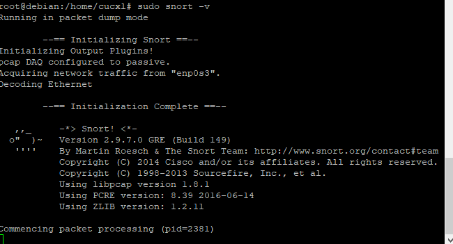
#### 实验一：配置snort为嗅探模式  
```
# 显示IP/TCP/UDP/ICMP头
snort –v

# 显示应用层数据
snort -vd

# 显示数据链路层报文头
snort -vde

# -b 参数表示报文存储格式为 tcpdump 格式文件
# -q 静默操作，不显示版本欢迎信息和初始化信息
snort -q -v -b -i eth1 "port not 22"
```  
  
* `ping www.baidu.com` 查看ICMP头  
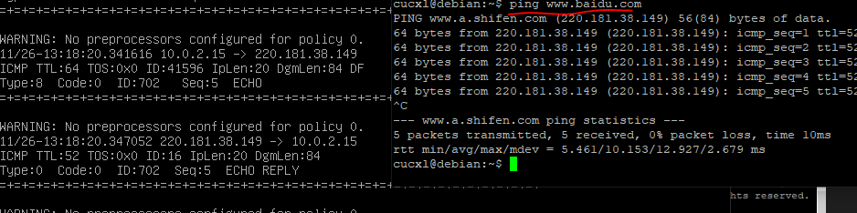  

* `snort -q -vd` 显示应用层数据  
  

* `snort -q -vde` 显示数据链路层数据  
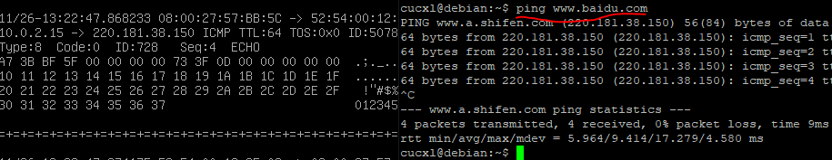  

* `snort -q -v -b -i enp0s3 "port not 22"` 保存嗅探的数据  
    ```
    # 使用 CTRL-C 退出嗅探模式
    # 嗅探到的数据包会保存在 /var/log/snort/snort.log.<epoch timestamp>
    # 其中<epoch timestamp>为抓包开始时间的UNIX Epoch Time格式串
    # 可以通过命令 date -d @<epoch timestamp> 转换时间为人类可读格式
    # exampel: date -d @1511870195 转换时间为人类可读格式
    # 上述命令用tshark等价实现如下：
    tshark -i eth1 -f "port not 22" -w 1_tshark.pcap
    ```  
      

#### 实验二：配置并启用snort内置规则  
```
# /etc/snort/snort.conf 中的 HOME_NET 和 EXTERNAL_NET 需要正确定义
# 例如，学习实验目的，可以将上述两个变量值均设置为 any
snort -q -A console -b -i eth1 -c /etc/snort/snort.conf -l /var/log/snort/
```  

* `vi /etc/snort/snort.conf` 查看配置文件  
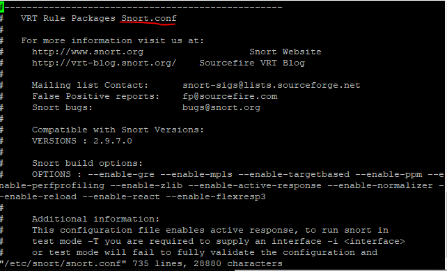  
* `HOME_NET`和`EXTERNAL_NET`设置为`any`  
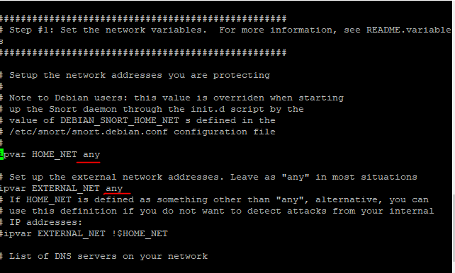  
* `snort -q -A console -b -i enp0s3 -c /etc/snort/snort.conf -l /var/log/snort/` 启动规则  
  

#### 实验三：自定义snort规则  

 ```
# 新建自定义 snort 规则文件
cat << EOF > /etc/snort/rules/cnss.rules
alert tcp \$EXTERNAL_NET any -> \$HTTP_SERVERS 80 (msg:"Access Violation has been detected on /etc/passwd ";flags: A+; content:"/etc/passwd"; nocase;sid:1000001; rev:1;)
alert tcp \$EXTERNAL_NET any -> \$HTTP_SERVERS 80 (msg:"Possible too many connections toward my http server"; threshold:type threshold, track by_src, count 100, seconds 2; classtype:attempted-dos; sid:1000002; rev:1;)
EOF
```  
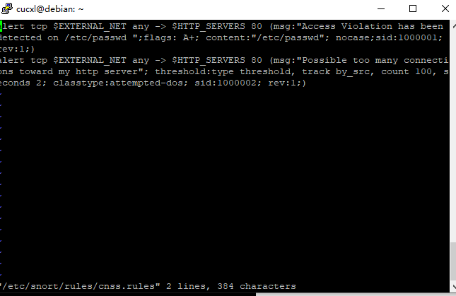  

```
# 添加配置代码到 /etc/snort/snort.conf
include $RULE_PATH/cnss.rules
```  

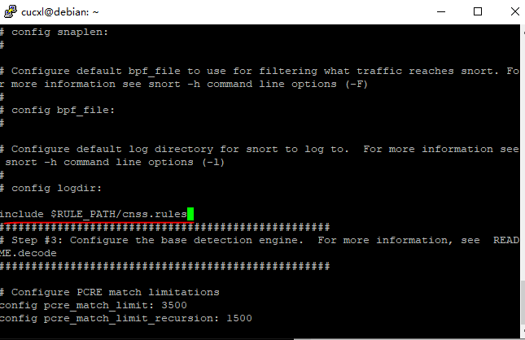  
```
snort -q -A fast -b -i enp0s3 -c /etc/snort/snort.conf -l /var/log/snort/
```  
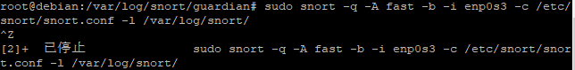  

#### 实验四：和防火墙联动  
本实验需要用到的脚本代码[Guardian-1.7.tar.gz](https://c4pr1c3.github.io/cuc-ns/chap0x09/attach/guardian.tar.gz)  
本实验网络拓扑环境：  
 本次实验使用的最小化的实验环境是2台主机，网络拓扑信息如下：
```
VM-1 IP: 172.16.222.142 intnet2 Host-only 运行 nmap 扫描 VM-1
VM-2 IP: 172.16.222.1 intnet2 Host-only 运行 snort 和 guardian.pl
```

开始实验之前，VM-1 和 VM-2 可以互相双向访问。

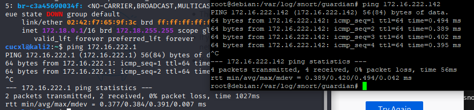 

snort所在主机VM-2：  
```
#获取脚本代码
wget https://c4pr1c3.github.io/cuc-ns/chap0x09/attach/guardian.tar.gz
# 解压缩 Guardian-1.7.tar.gz
tar zxf guardian.tar.gz
# 安装 Guardian 的依赖 lib
apt install libperl4-corelibs-perl
# 开启 snort
snort -q -A fast -b -i enp0s3 -c /etc/snort/snort.conf -l /var/log/snort/
```  
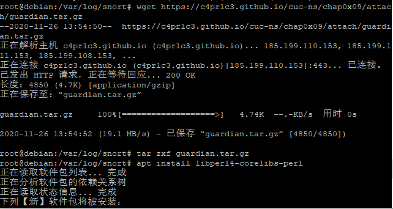  
编辑`guardian.conf`并保存，确认以下2个参数的配置符合主机的实际环境参数  
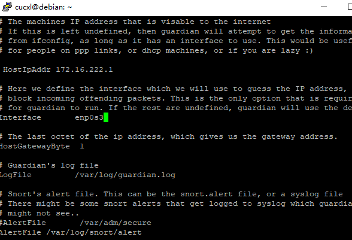  
`perl guardian.pl -c guardian.conf` 启动`guardian.pl`  
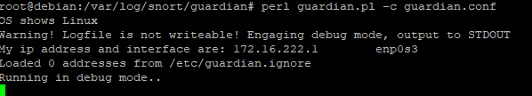


在VM-1中用`nmap`暴力扫描  
`nmap 172.16.222.1 -A -T4 -n -vv`  
`guardian.conf`中默认的来源IP被屏蔽时间是 60 秒（屏蔽期间如果黑名单上的来源IP再次触发snort报警消息，则屏蔽时间会继续累加60秒）
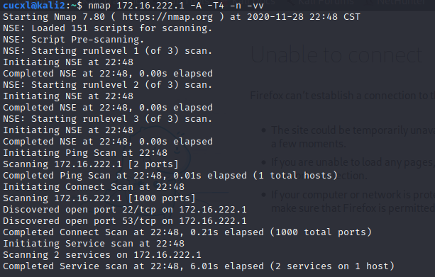 
```
root@alina:~/down/guardian# iptables -L -n
Chain INPUT (policy ACCEPT)
target     prot opt source               destination
REJECT     tcp  --  172.16.222.142       0.0.0.0/0            reject-with tcp-reset
DROP       all  --  172.16.222.142       0.0.0.0/0

Chain FORWARD (policy ACCEPT)
target     prot opt source               destination

Chain OUTPUT (policy ACCEPT)
target     prot opt source               destination

# 1分钟后，guardian.pl 会删除刚才添加的2条 iptables 规则
root@alina:~/down/guardian# iptables -L -n
Chain INPUT (policy ACCEPT)
target     prot opt source               destination

Chain FORWARD (policy ACCEPT)
target     prot opt source               destination

Chain OUTPUT (policy ACCEPT)
target     prot opt source               destination
```  

### 问题及解决  
1. 无交互页面安装`snort`失败  
错误原因：网卡设置的是enp0s3,默认是eth0

解决方案：弹出交互页面手动配置网卡
2. 运行命令时显示
```
bash: snort：未找到命令
``` 
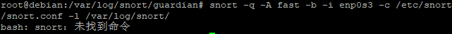 
错误原因：不清楚。

解决方案：加sudo。但已经是root权限为什么还要sudo？


#### 参考资料  
[网络安全教材第九章实验](https://c4pr1c3.github.io/cuc-ns/chap0x09/exp.html)  
[2019-NS-Public-chencwx](https://github.com/CUCCS/2019-NS-Public-chencwx/blob/ns_chap0x09/ns_chapter9/%E5%85%A5%E4%BE%B5%E6%A3%80%E6%B5%8B.md) 